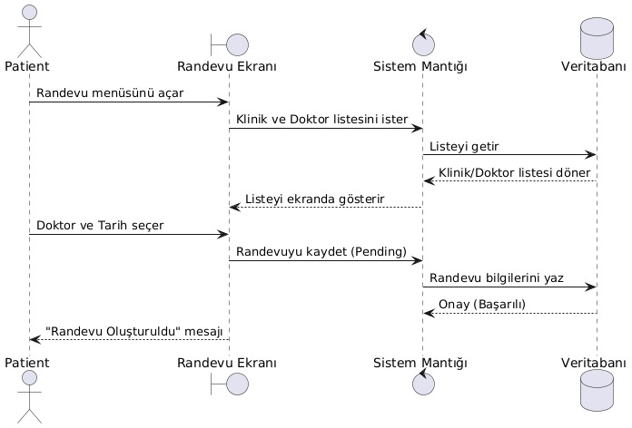
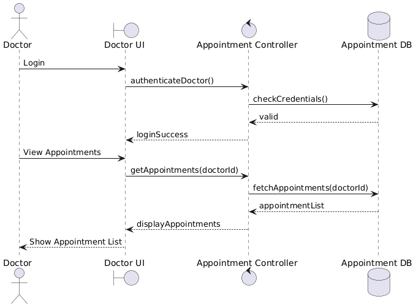

# Hospital Appointment Management System

Bu proje, bir hastane randevu sisteminin UML diyagramları ve basit bir web uygulaması ile modellenmesini amaçlamaktadır.

---

## 📌 UML Diyagramları

### 🔹 Use Case Diagram

### 🔹 Class Diagram

---

## 🔁 Sequence Diagrams

### 🧑‍⚕️ Book Appointment – Patient

### 👨‍⚕️ Doctor Views Appointments

---

## 🧩 PlantUML Kodları
Book Appointment – Patient (Sequence Diagram)
@startuml
actor Patient
boundary "Patient UI" as UI
control "Appointment Controller" as AC
database "Appointment DB" as DB

Patient -> UI : Request Appointment
UI -> AC : createAppointment()
AC -> DB : saveAppointment(status="Pending")
DB --> AC : success
AC --> UI : confirmation
UI --> Patient : Appointment Created
@enduml

Doctor Views Appointments (Sequence Diagram)
@startuml
actor Doctor
boundary "Doctor UI" as UI
control "Appointment Controller" as AC
database "Appointment DB" as DB

Doctor -> UI : Login
UI -> AC : authenticateDoctor()
AC -> DB : checkCredentials()
DB --> AC : valid
AC --> UI : loginSuccess

Doctor -> UI : View Appointments
UI -> AC : getAppointments(doctorId)
AC -> DB : fetchAppointments(doctorId)
DB --> AC : appointmentList
AC --> UI : displayAppointments
UI --> Doctor : Show Appointment List
@enduml

## 💻 Uygulama Dosyaları
- index.html
- script1.js
- style1.css
