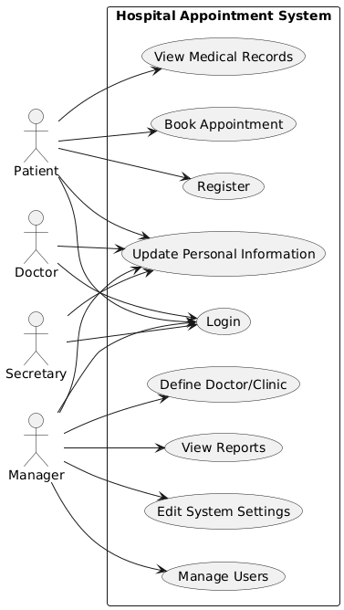
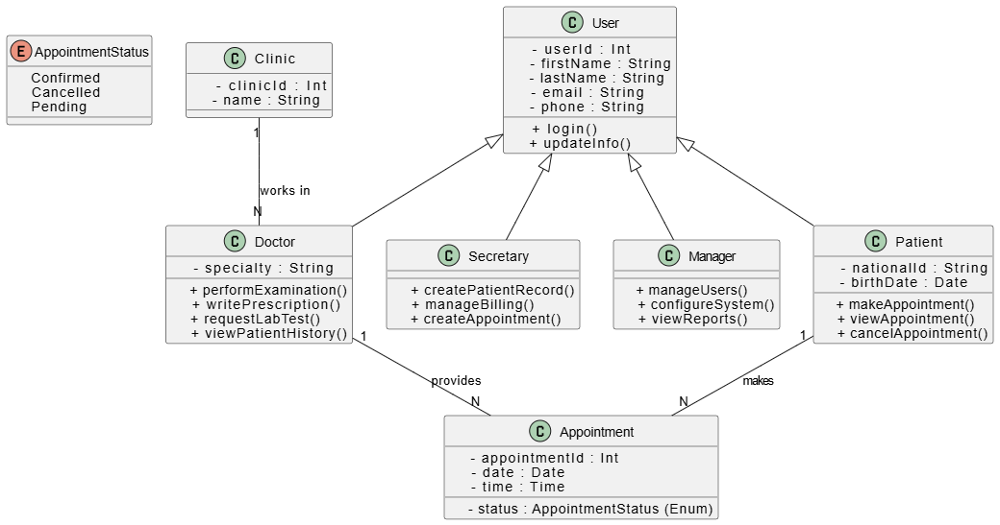

# Hospital Appointment Management System

Bu proje, bir hastane randevu sisteminin UML diyagramları ve basit bir web uygulaması ile modellenmesini amaçlamaktadır.

## 📝 Use Case Senaryosu
Sequence diagram ile modellenen ana etkileşim:
**Hasta Randevu Alma (Book Appointment)**  
Detaylı senaryo Word belgesinde yer almaktadır.

## 🧩 PlantUML Dosyaları
- hastane_sequence.puml.txt
- doctor_view_sequence.puml.txt

## 💻 Uygulama Dosyaları
- index.html
- script1.js
- style1.css
